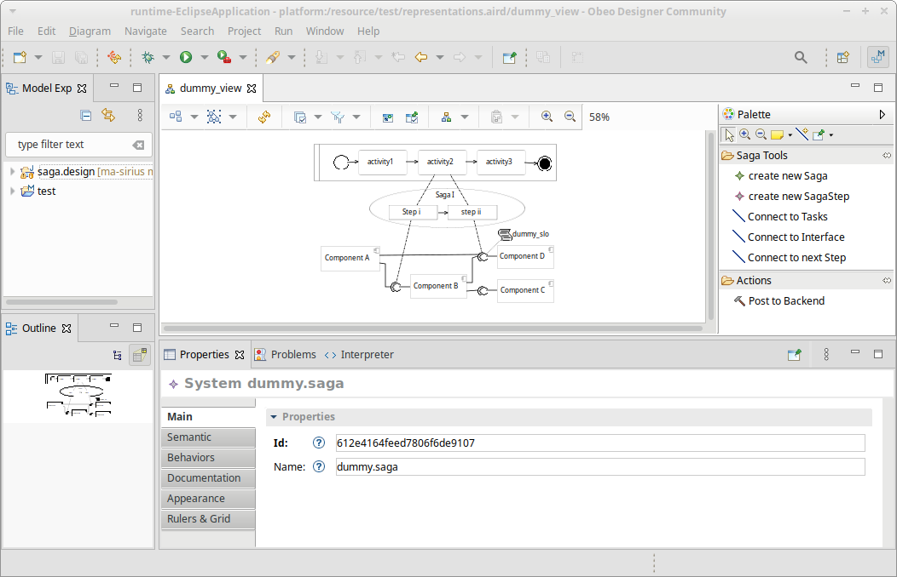

# Master thesis Models and Editor

This repository contains the ecore models for the master thesis "Tracing the Impact of SLO Violations on Business Processes across a Microservice Architecture with Saga Pattern" by Sarah Sophie Stieß (that's me).

As for this repositories structure, these folder contain the models : 

folder                      | content
----------------------------|----------
[de.unistuttgart.ma.saga](./de.unistuttgart.ma.saga)     | ecore model for the saga and the connections. the actual contribution of the thesis.
[de.unistuttgart.gropius](./de.unistuttgart.gropius)     | ecore model for gropius. modelled after [gropius' graphql schema](https://github.com/ccims/ccims-backend-gql/blob/739e2f9e76805204ea23c6f295469abc6fcd8656/schema/schema.graphql)
[de.unistuttgart.gropius.slo](./de.unistuttgart.gropius.slo) | ecore model for slo rules. modelled after [solomon's model](https://github.com/ccims/solomon-models/blob/ea01537144520233640fc83e739ac5b7d02ff9ec/src/slo-rule.model.ts)

For these there are always three folders, their content is as follows:

folder-suffix   |  purpose
----------------|----------
\<name\>        | contains the model itself (`*.ecore`), the representation to actually look at it (`*.aird`), the generator model to generate code (`*.generator`), and the generated model code. 
\<name\>.edit   | contains utility classes to edit instances of the model. generated.
\<name\>.editor | an editor (eclipse plugin) to edit instances of the model. generated.

If you want to really understand this, you better read up on the EMF and Ecore. 

There are also folders with other things : 

folder                      | content
----------------------------|----------
[de.unistuttgart.ma.impact](./de.unistuttgart.ma.impact)        | ecore model for impacts. only used to generated classes for the back end (no editor and stuff), that is why it is not listed above. 
[saga.design](./saga.design)    | design of the editor. 

## Model Dependencies 

The models depend on each other as depicted below. 
The BPMN model from `org.eclipse.bpmn2` can be found here: 
[https://git.eclipse.org/c/bpmn2/org.eclipse.bpmn2.git/](https://git.eclipse.org/c/bpmn2/org.eclipse.bpmn2.git/)

(when importing the projects, make sure to import the dependencies before the dependents... or else ugly things might happen.)

## Editor Dependencies

The Editor consists of two plugins, the `de.unistuttgart.ma.saga.editor` for the basic editing functionalities, and the `saga.design` for the 'good' looks. 

The latter depends on the former and both depend on all the models.
That is also known to the manifests, so actually there should be no problems. 

## Requirements I - Development
The models and editor where designed with the tool / eclipse plugin and versions listed below. Also Java 11. 

Tool / Plugin                                     | version
--------------------------------------------------|------------
[Obeo Designer](https://www.obeodesigner.com/)    | `11.5`
[Eclipse Sirius](https://www.eclipse.org/sirius/) | `6.5.1`
[Sirius ELK Integration (Experimental)]()         | `6.5.1`

## Requirements II - Usage

To work properly the editor need some services to run in the background. 
They are listed below. 
At least the thesis' backend must be up to create models. 
All others are optional. 
With out them, the import of existing  model will fail and you will end up with and entirely empty model. 
Which is also okay, as you can still add any kind of elements manually, but it is not what we *want*.

The versions, are those with which the editor has been tested up to now. 

Tool                     | version (commit)         | purpose
-------------------------|----------------------|-----------
[Thesis’ backend](https://github.com/stiesssh/ma-backend) | f87dc5ccf7875461eb9e8769331fb09c58f54b04 | Does all the importing work.
[Gropius backend](https://github.com/ccims/ccims-backend-gql) | 123381d602a53241d270256b471874578cd621be | Cross-component issue management tool. For us, it provides the architecture. If there is not yet any architecture you must add one yourself. When adding a new architecture, it might be recommendable to also run the [Gropius frontend](https://github.com/ccims/ccims-frontend).
[Solomon](https://github.com/ccims/solomon) | d1861e603a122b23c959511a35a5c6668deadb7f | sla management tool. for us, it provides the slo rules. If there are not yet any Slo rules, you must add them yourself. When adding new Slo rules, it might be recommendable to also run the front end. Otherwise, the back end is sufficient.

## Usage (Developers mode)
1. Get some tool, that's able to handle EMF stuff. 
2. import everything.
3. choose `Run as Eclipse Application`
4. A Runtime Eclipse will open and you can use the model editor. 

## Usage (Editor Tutorial) 

Upon starting the Runtime Eclipse (the *actual* editor), you first need to create a new model.
1. Create a project to put the model into : *File* ->  *New* -> *Modelling Project* 
2. Create the model : 
    * *File* -> *New* -> *Other...* 
    * search for and select *Saga Model* and click *Next >*
    * choose previously created project and click *Next >*
    * do nothing and click *Next >*
    * enter the required values and click *Finish*
3. Open the right view:
    * open the representation file (`*.aird`). If it is missing, create one. 
    * enable the `System View` in the representation section.
    * and create a new view, either by double clicking or by clicking the *New...*
    * choose the newly created model and click *Finish*
    * give the model a name of your choice and confirm. 

You should now see something akin to this (the model in the editor pane is most likely a different one):

On the left of the picture are the *Model Explorer* view and the *Outline* view, on the bottom are the *Properties* view and others. 
Nothing new there. 

In the middle is the editor pane, which is defined by the `saga.design` plugin. 
Its most important elements are the graphical representation of the model and the tool bar on the right. 

### The Tools :
* `create new Saga` : add a new Saga to the model. 
* `create new SagaStep` : add a new Step to the most recently Created Saga. You can not add any steps when there are not yet any Sagas.
* `Connect to Task` : connect a SagaStep to a Task.
* `Connect to Interface` : connect a SagaStep to an Interface.
* `Connect to next Step` : set reference to the SagaStep, that comes after this SagaStep. 
* `Post to Backend` : after editing the model to your liking, you use this to post it to the thesis' backend. The Editor prompts you once again for the location of the thesis' backend. Most sadly it does so via command line :(

### Other Points of Interaction: 
* all elements may be moved, either alone or in groups. 
* tasks and steps can not leave their container (process / saga) but can be moved therein.
* edges that originate at steps can be reconnected by dragging the opposite end to another task / interface / step.
* Slo rules and Sagas can be hidden or shown by (de) selecting their layer under *Layers* (fourth icon from the left in the icon bar at the upper edge of the editor pane)